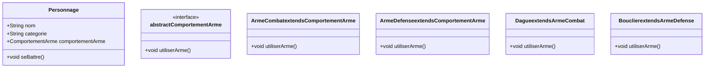

```mermaid
classDiagram
    class Personnage {
        +String nom
        +String categorie
        +ComportementArme comportementArme
        +void seBattre() 
    }

    class abstract ComportementArme {
        <<interface>>
        +void utiliserArme()
    }

    class ArmeCombat extends ComportementArme {
        +void utiliserArme()
    }

    class ArmeDefense extends ComportementArme {
        +void utiliserArme()
    }

    class Dague extends ArmeCombat {
        +void utiliserArme()
    }

    class Bouclier extends ArmeDefense {
        +void utiliserArme()
    }


```